# Cleaning Up

## Code Pipeline

1. Delete Code Pipeline
   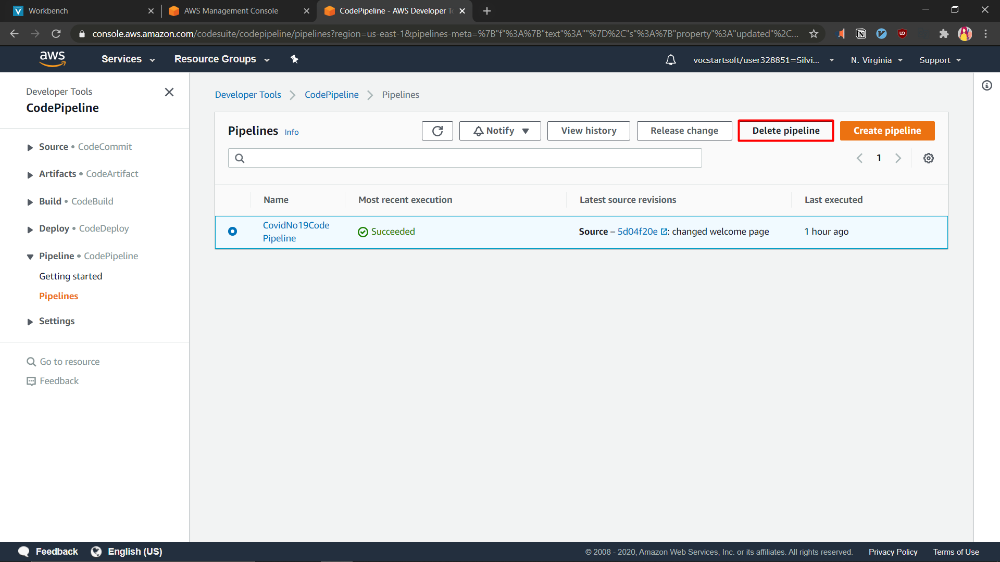

2. Confirm delete code pipeline 
   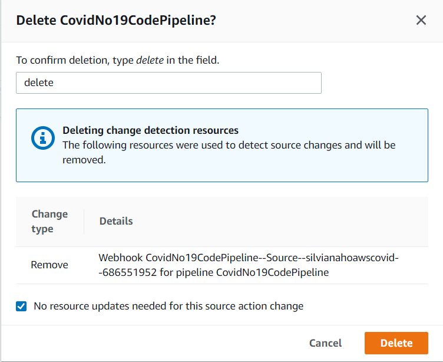

3. Deleted State
   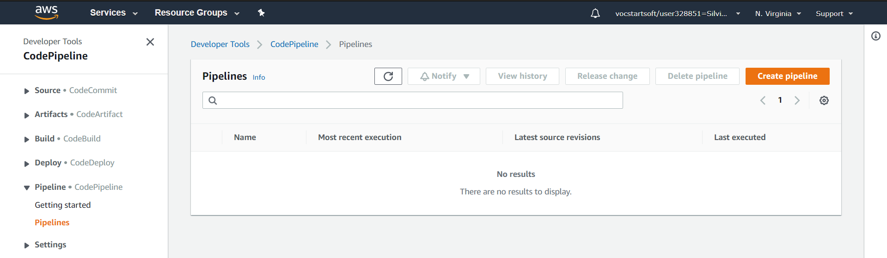

## Elastic Beanstalk

1. Delete Application
   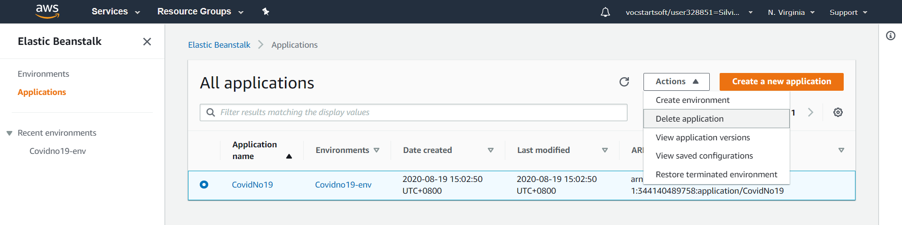

2. Confirm delete application
   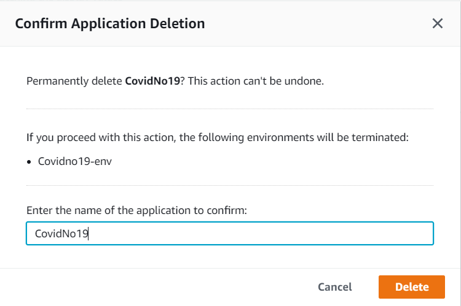

3. Deleting in progress
   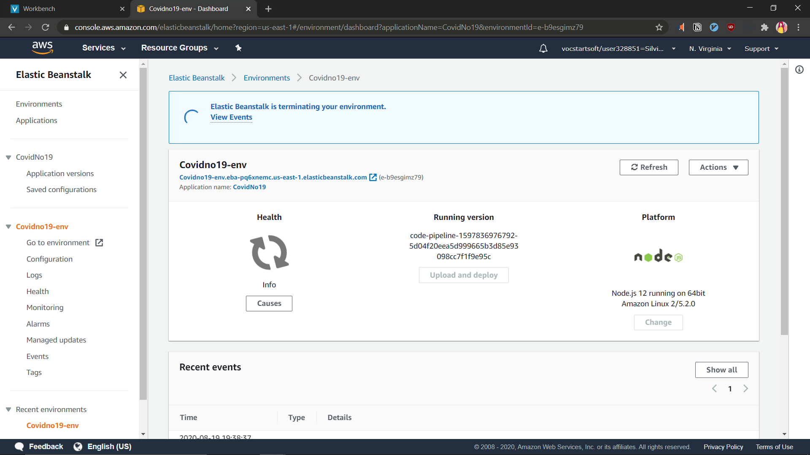
   We need to wait for a while for elastic beanstalk to terminate everything, we can terminate other services such as cloudfront and S3 while waiting for the termination process to complete.

4. Deleted
   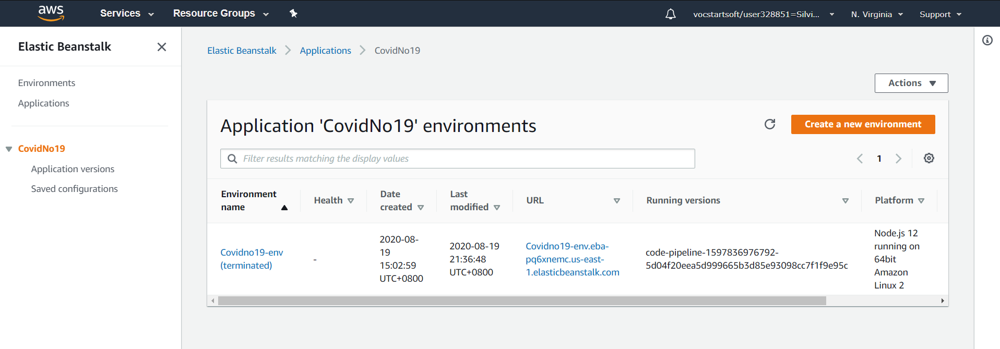

## Cloudfront

1. Disable Distribution
   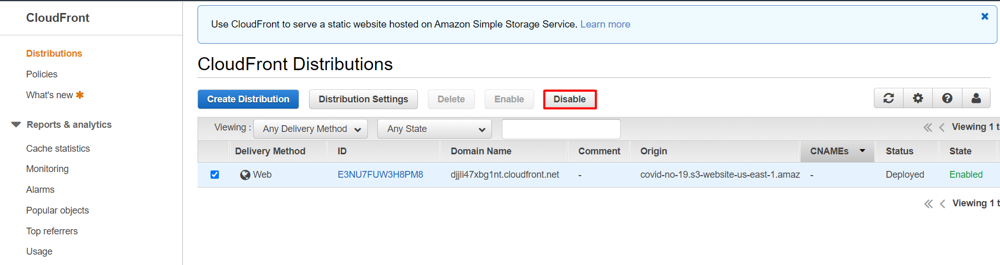
   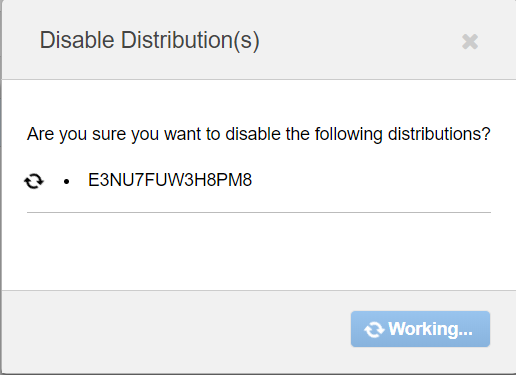
   We would need to wait for around 5-15 minutes for it to disable completely before we are able to delete the distribution. Meanwhile, we can delete our S3 bucket.

2. Delete Distribution
   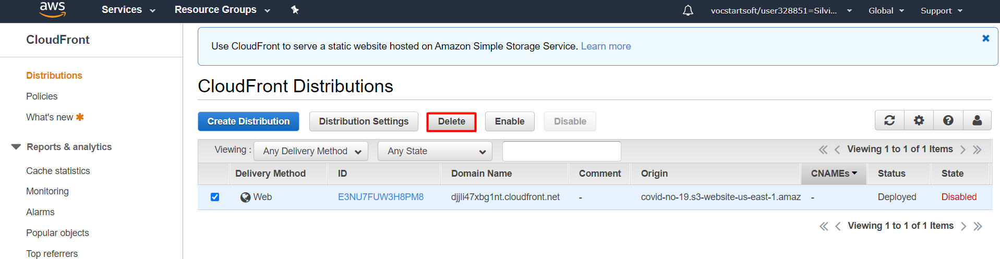
   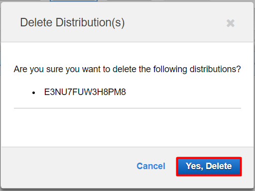
3. Deleted State
   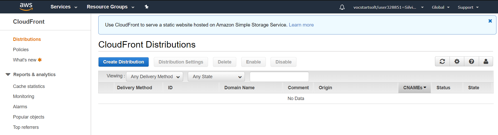

## S3 Bucket
 
1. Empty Bucket
   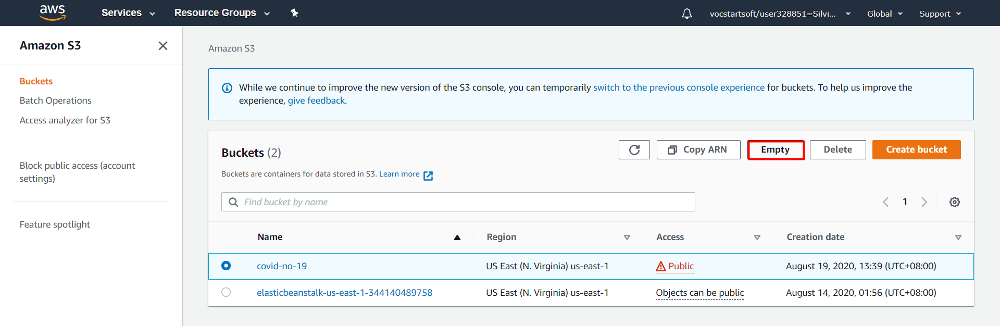
   
   Enter bucket name to confirm deletion.
   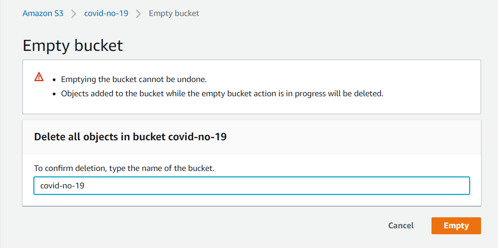

   Emptied bucket
   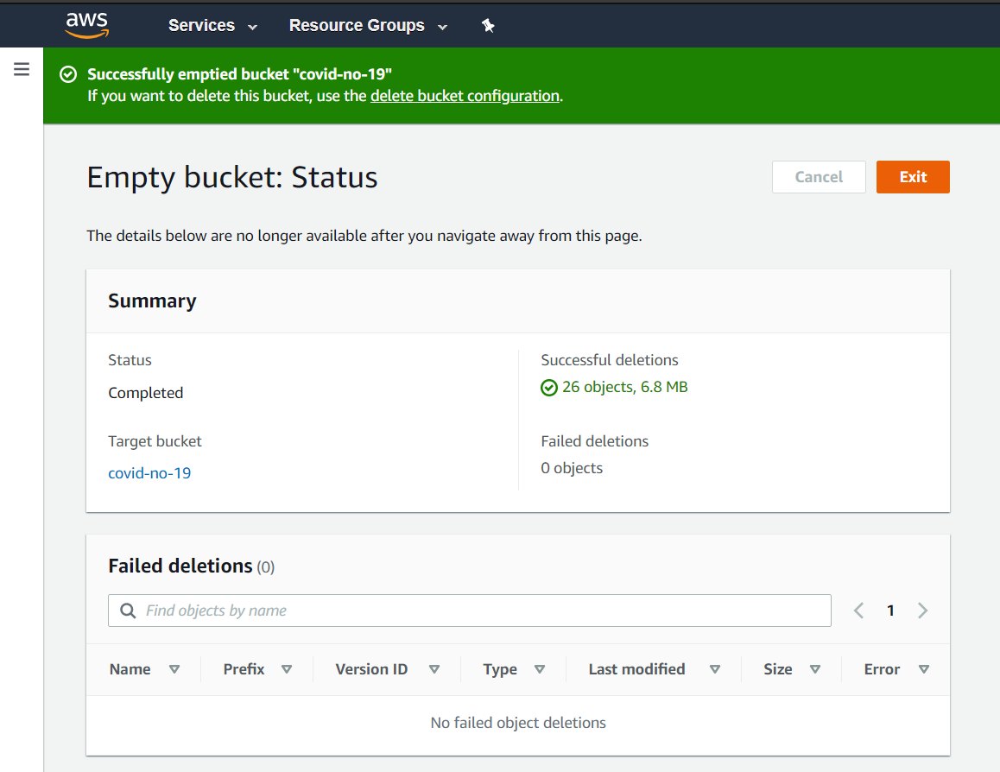
2. Delete Bucket
   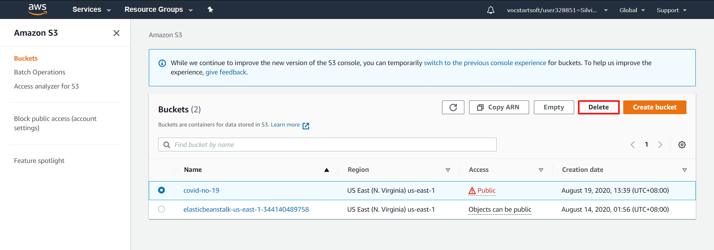
   Enter bucket name to confirm deletion.
   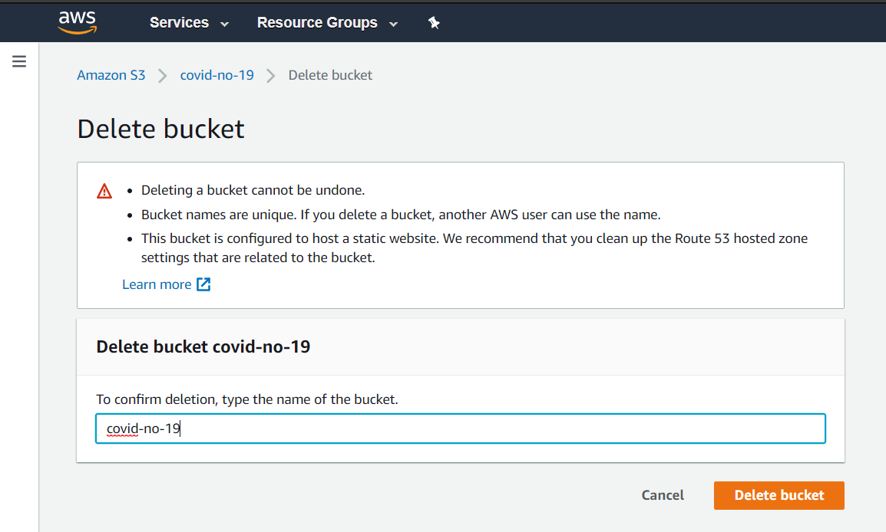
3. Deleted State
   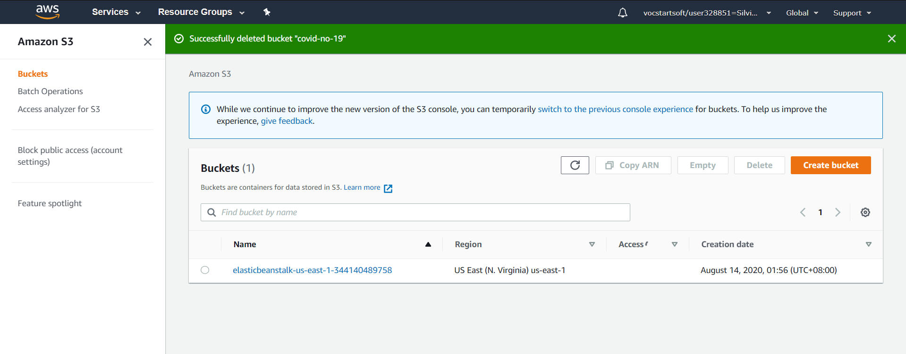