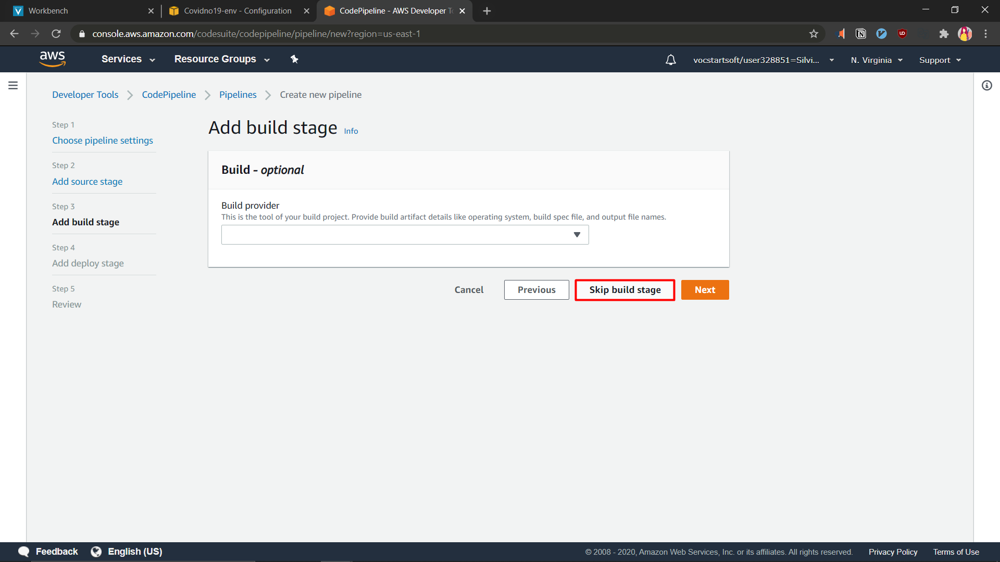

# Code Pipeline Setup

1. Create CodePipeline
   * Navigate to CodePipeline on AWS Console and click on create pipeline
   
   * Give it a name!
   
   * We are using Github as a version control for our application. Hence, we are chose github as the source and connected our github account. Then, we selected the correct repository and branch.
   
   * Skip build stage because we are going to build our applications locally
   
   * Choose Elastic Beanstalk as the deploy provider and choose the application and environment we created earlier
   
   * Review and create the pipeline
   
   * Wait for the application to deploy for the first time
   

2. Deploy Application via CodePipeline
   Once you've made changes to your code, stage, commit and push to github.
   
   Then, CodePipeline will automatically pick up that there are changes and deploy the application to elastic beanstalk.
   

3. View Application
   There are different ways to access our server, two of them are through Elastic Beanstalk Environment Endpoint or Postman.
   
   
   
4. Inserting Data from Postman
   
   Result:
   