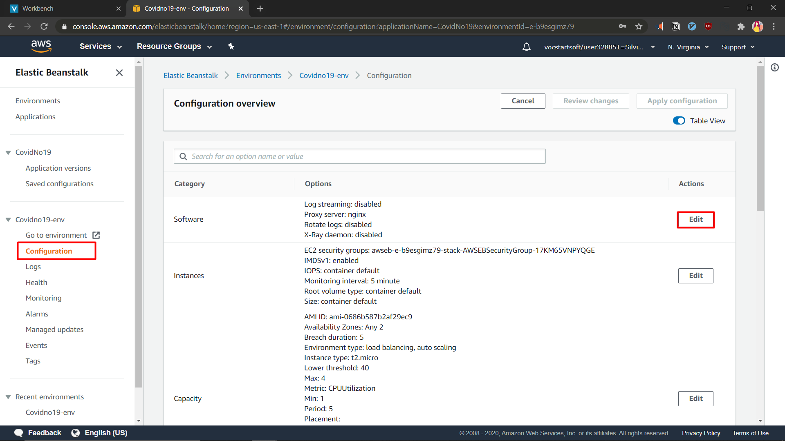

# Elastic Beanstalk Setup

1. Create Elastic Beanstalk Application
   * Navigate to Elastic Beanstalk on AWS Console and click on `Create Application`
   

   * Name the Elastic Beanstalk application and add a tag (optional)
   

   * Select platform version and sample application code (we are going to deploy our server from code pipeline later on). Press `Create Application` and wait for the application to deploy.
   

   * This is how it looks like after a successful deployment
   

2. Add Elastic Load Balancing and Auto Scaling Group to Elastic Beanstalk Environment
   * Navigate to `Configuration`, scroll down to the `Capacity` category and press the `Edit` button.
   
   
   * Modify the `Environment Type`, `Number of Instances`, `Instance Type`, `Availability Zones`, and `Scaling Triggers`
   
   
   
   * Read the warning message and `Confirm`
   

   * Wait for the application to deploy again.

3. Add an Amazon RDS Database to Elastic Beanstalk Environment
   * After a successful deployment, navigate to `configuration`, scroll down to `Database` category, and `Edit`
   
   * Modify database configurations as needed. In our case, since our website is relatively small, we are using a `MySQL` database engine with `db.t2.micro` instance class and 5GB storage.
   
   Set a username and password to log into our database engine, change the availability to high, and click `Apply`.
   
   
4. Connect to DB Instance
   We need these to connect our Node.js server to our database.
   * After another successful deployment, we can navigate back to `Configuration`. Scroll down to `Database` category again and click on the endpoint that has been created.
   
   * The endpoint will lead us to Amazon RDS Console. On the RDS console, click on our newly created database.
   
   * Click on the security group and a new tab will open and take us to the security group.
   
   * Edit Inbound Rule to allow all TCP connections from our network (My IP).
   
   

5. Create Table
   We are going to use MySQL Workbench to connect to our RDS Database.
   * Create Connection
   
   * Key in our `RDS endpoint` on the `host` field and input our RDS `username` and `password`. (Optional) The default schema is `ebdb` (this is created by default). Click `OK` and wait for connection to be eastablished.
   
   * Once we are connected, we can create a table in our database.
   
   ```sql
    USE ebdb;
    CREATE TABLE IF NOT EXISTS 
	listings (
		id INT NOT NULL, 
        title VARCHAR(255) NOT NULL, 
        description VARCHAR(255) NOT NULL, 
        price DOUBLE PRECISION NOT NULL, 
        category INT NOT NULL);
   ```

6. Set Environment Variables
   Now, let's set our environment variable because we need the database credentials in order for our nodejs server to connect to our database.
   * Navigate to `Configuration` > `Software` > `Edit`
   
   * Key in the following fields according to your database configuration and click apply
   
   * Wait until environment change is fully deployed and move on to the next step ([setting up code pipeline](/aws-acf-lab3-part2/code_pipeline))
   