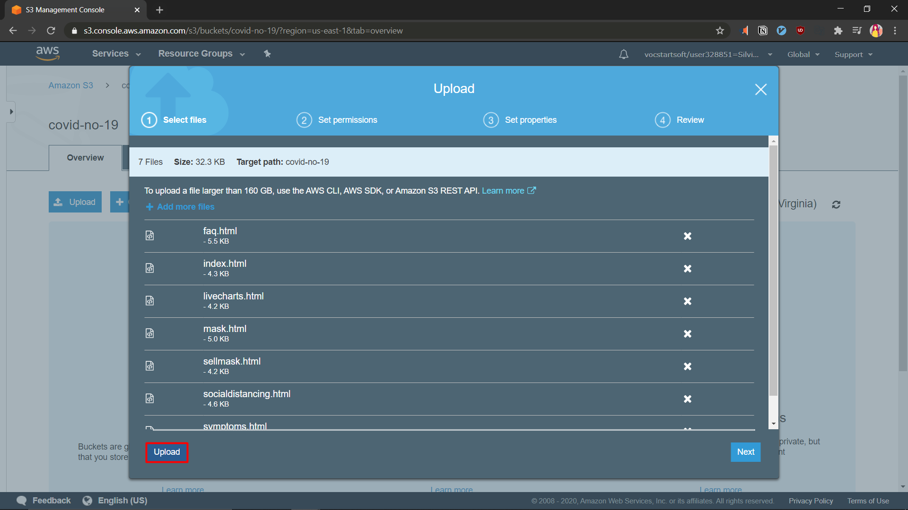
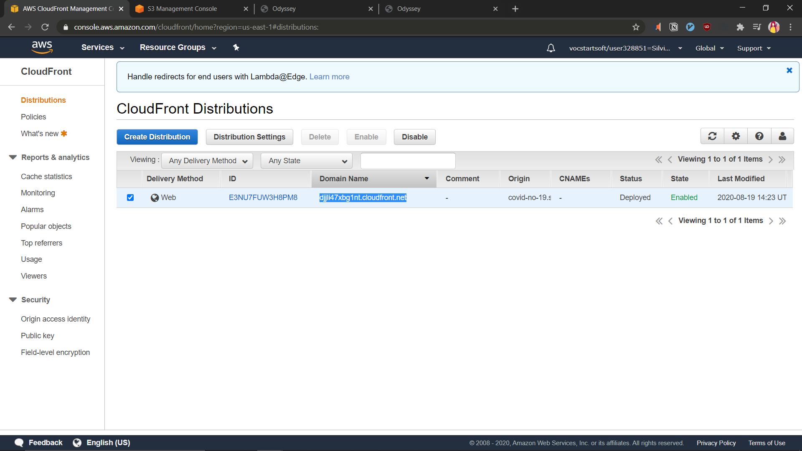

# Static Content Hosting

## Step 1: Host Website on S3

1. Create Bucket
   
   Fill in the bucket name with a unique and valid name, then accept the default settings.
   
   

2. Upload Static Content
   
   
   

3. Configure Static Website Hosting Property
   
   

4. Edit block public access settings
   
   
5. Add bucket policy to make bucket content publicly available
   
   ```json
   {
     "Version": "2012-10-17",
     "Statement": [
       {
         "Sid": "PublicReadGetObject",
         "Effect": "Allow",
         "Principal": "*",
         "Action": ["s3:GetObject"],
         "Resource": ["arn:aws:s3:::covid-no-19/*"]
       }
     ]
   }
   ```
6. Test S3 Website Endpoint
   Return to `Properties` page, click on `Static Website Hosting` and Click on the endpoint provided.
   
   
   
   

---

## Step 2: Serve static website hosted on S3 with Cloudfront

1. Navigate to Amazon Cloudfront
   
2. Create Distribution
   
   
   
   Copy the url of our S3 hosted website.
   

   Paste URL on the `Origin Domain Name` field and select redirect HTTP to HTTPS.
   

   Select Price Class, type of SSL certificate, and supported HTTP versions.
   

   Create Distribution
   

3. Test Endpoint
   We will be redirected to the cloudfront distributions dashboard. Wait for the state to change from `In Progress` to `Enabled`.
   
   Once enabled, copy the cloudfront endpoint.
   
   Open a new tab and access the endpoint using your browser.
   